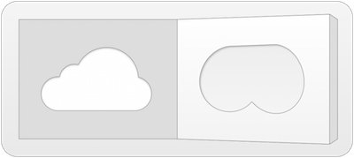

cloud-to-butt
=============

##### Fork of [panicsteve/cloud-to-butt](https://github.com/panicsteve/cloud-to-butt) with support to manifest v3

Chrome extension that replaces occurrences of 'the cloud' with 'my butt'

[Direct download of crx file](https://github.com/gabrielfalcao/cloud-to-butt/blob/master/CloudToButt.zip?raw=true)

Screenshot Gallery
------------------

http://www.flickr.com/groups/cloud-to-butt/

Installation
------------

In Chrome, choose Window > Extensions.  Drag CloudToButt.zip into the page that appears.
